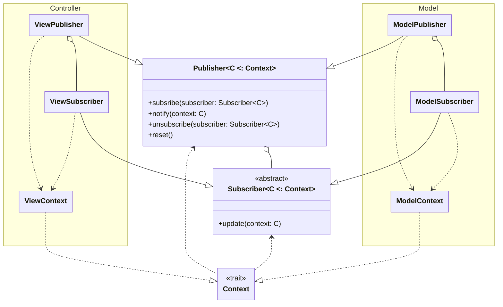

# Design di dettaglio

## Publisher

Molte parti del sistema necessitano di scambiarsi messaggi l'una con l'altra, per esempio se dovessero cambiare le risorse di un giocatore bisognerebbe avvisare la view affinché mostri il valore corretto, ma bisogna anche fare in modo che si aggiornino le missioni disponibili all'acquisto a seconda del nuovo valore.
Per questo motivo si è optato per l'utilizzo del pattern Observer, con la struttura riportata di seguito

Il tipo C rappresenta il tipo di `Context` che viene gestito da `Publisher` e `Subscriber`.
Le varie parti del codice pubblicano eventi per mezzo del `Publisher`, il quale lo invia in modalità broadcast a tutti i suoi `Subscriber`, a questi ultimi definiscono le azioni da compiere per il dato `Context`.

Dato che nel sistema ci sono molte entità che possono generare eventi che interessano molti subscriber e che questi eventi si sovrappongono, rimanendo sul cambio di risorse questo può avvenire in vari contesti e in ognuno dei quali va ad interessare varie componenti della view, che si devono aggiornare di conseguenza. Per questo motivo si è optato per l'utilizzo del pattern Singleton per le implementazioni di `Publisher`, in particolare sono stati utilizzati `ModelPublisher` e `ViewPublisher` per la pubblicazione di tutti gli eventi del programma, si è optato per l'utilizzo di due `Publisher` per mantenere la separazione dettata da MVC.

## Navigator

Come abbiamo già spiegato per la realizzazione della GUI si è optato per l'utilizzo di scalaFX, tuttavia non si voleva creare una dipendenza forte da questa libreria. Per ovviare a questo problema abbiamo realizzato un sistema di navigazione tra le pagine che nascondesse il più possibile le classi di scalaFX al controller.
Il sistema è stato realizzato seguendo il seguente schema:

Si riporta una breve spiegazione:
- Tipi generici:
    - **T**: Il tipo base della libreria grafica(es: Node per JavaFx, Component per Java Swing).
    - **VS**: Il tipo sottoclasse di `ViewState` che viene accettato da `Navigator` e `ViewFactory`.
- Trait:
    - `ViewState`: Un  trait usato per denotare le classi che possono essere accettate da un `Navigator` o una `ViewFactory`.
    - `Navigator[VS]`: Ha il compito di gestire i cambi di `MainStage`.
    - `MainStage[T]`: Rappresenta il contenitore delle scene.
    - `ViewScene[T]`: Rappresenta una scena della view.
    - `ViewFactory[T, VS]`: Ha il compito di creare le scene concrete.
    - `ControllerManager`: Fornisce alla `ViewFactory` le dipendenze necessarie per creare le `ViewScene`
    - `ControllerStage[VS]`: Wrapper per la navigazione che permette di aggiungere altre operazioni al cambio di scena. Si tratta della classe che viene utilizzata dalla view per richiedere il cambio di scena.

Grazie a questa struttura possiamo gestire la View nascondendo il tipo concreto di T dal resto del controller, mantenendo il codice abbastanza flessibile da permettere l'aggiunta di nuove pagine se fosse necessario.

## Turn Manager

Per gestire al meglio quali azioni si possono eseguire nelle varie fasi del turno si è creato un `TurnManager` che permette di definire la macchina a stati del turno. A `TurnManager` si affiancano `TurnAction` e `TurnStep`:
- `TurnAction`: Definisce quali tipi di azioni sono presenti nel gioco, quando queste sono disponibili e a quali transizioni portano.
- `TurnStep`: Le fasi del turno, ovvero gli stati della macchina a stati.
  In questo modo abbiamo delegato il controllo dei permessi riguardanti le azioni al `TurnManager`.