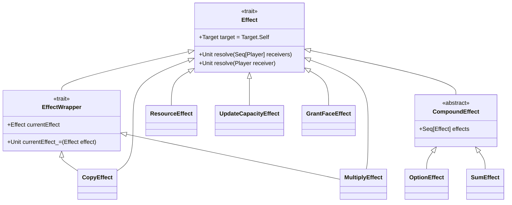
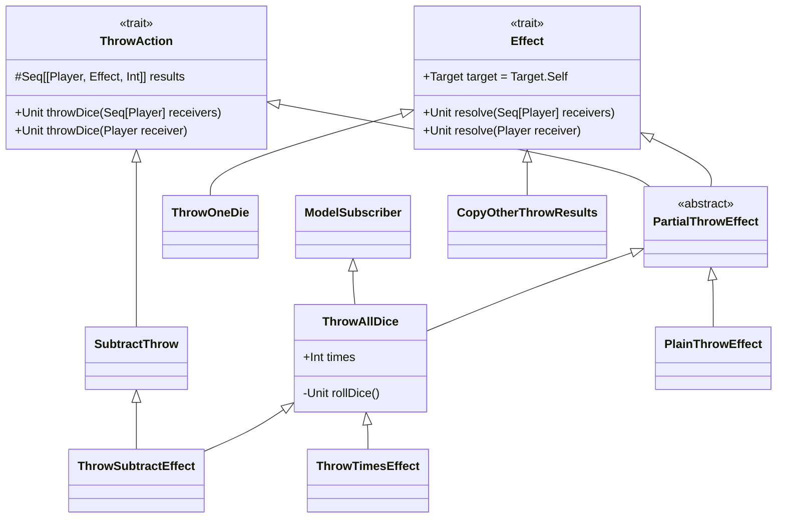
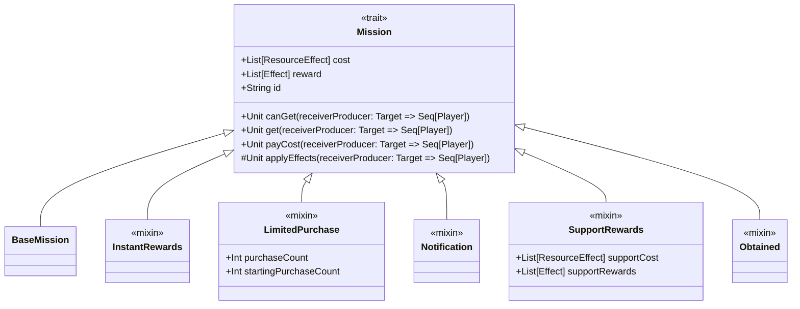
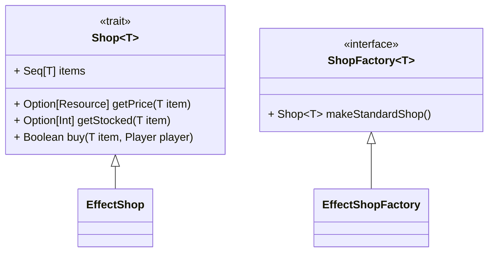
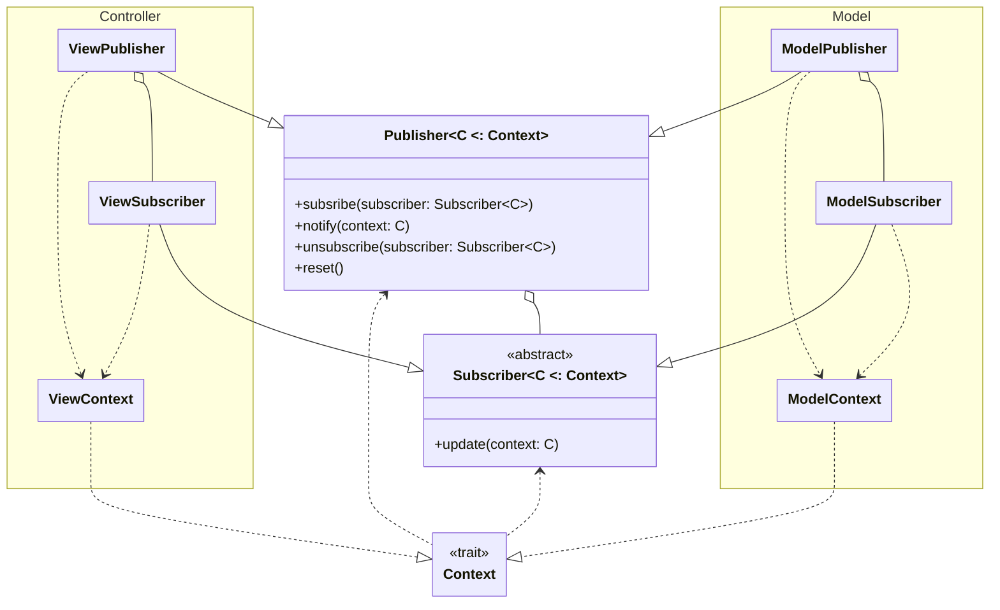

# 4. Design di dettaglio

## Elementi principali
Si effettua ora una breve descrizione degli elementi alla base del funzionamento del programma, che verranno descritti più
approfonditamente in seguito.

### Model
Analizzando i requisiti, ci si è resi conto che le ricompense delle missioni e le facce dei dadi operavano secondo principi
simili; è stato dunque deciso di riassumere entrambi i funzionamenti nel concetto di `Effect`, le istanze delle cui implementazioni
sarebbero state ricompense e costi delle missioni e facce dei dadi. Di conseguenza, lo `Shop` del gioco vende `Effect`. `GameManager` incapsula tutti gli elementi
che compongono una partita a Dice Forge, incluso il `TurnManager` per la gestione dei turni e il `MapManager` per l'individuazione della
posizione del giocatore sul tabellone delle missioni. Contiene anche una mappa di `Mission`, divise per casella, e la lista di `Player` della partita.
Ciascun `Player` ha al proprio interno un riferimento alla propria `PlayerBoard`, che contiene il conteggio delle `Resource`
a lui disponibili, ai propri due `Die`, e alle missioni che ha ottenuto.

### Controller
Ad ogni schermata della View corrisponde un Controller, che si occupa di fornire tutte le informazioni necessarie alla UI e di raccogliere
gli input degli utenti e trasmetterli al Model. A questi Controller accoppiati, se ne aggiungono due, `ControllerManager` che controlla lo Stage (ed ha quindi
il compito di cambiare la scena visualizzata), e `ControllerStage` per restituire il Controller necessario a quest'ultima. Una serie di DTO
è stata preparata per tradurre gli oggetti del Model in pacchetti di informazioni per la View, oscurandone l'implementazione. Il pattern Navigator, descritto
in seguito, è stato utilizzato per la navigazione di schermata in schermata. Il package `choices`, inoltre, contiene i Controller dedicati alle finestre di popup per le
varie scelte necessarie nel corso della partita.

### View
La view, scritta in _ScalaFX_, è composta da quattro schermate, ciascuna rappresentata da una `Scene`, un popup delle regole, e all'occorrenza un popup per le scelte. Il popup delle regole è
visualizzabile in qualsiasi momento nel menù principale o nel corso della partita, premendo il tasto "Regole". Il tema che l'applicazione doveva seguire è stato stabilito nel trait `Theme` e nella sua implementazione
`JfxTheme` per evitare che troppi colori rendessero l'interfaccia poco coesa e per permettere di cambiarli senza sostituirli manualmente in ogni elemento. Le `Factory` di `Button` e `Text` hanno la stessa funzione, riferita allo stile degli elementi che costruiscono.
L'object `LanguageStrings` contiene tutte le stringhe necessarie alla UI, eccetto quelle della rappresentazione delle missioni, che abbiamo scorporato per agevolarne l'eventuale cambiamento.

## Effect

L'effetto è stato uno dei primi concetti implementati. Il trait ha un metodo `resolve` che viene chiamato quando l'effetto va, appunto, risolto, ovvero quando avviene il completamento di una missione o quando vengono lanciati i dadi. Ciascun effetto eredita da Effect, ma per semplificare la fruizione dei diagrammi sono stati separati quelli che includono il lancio dei dadi da quelli che non lo prevedono.
`EffectWrapper` viene utilizzato dagli effetti che necessitano di un altro effetto su cui operare per essere risolti, mentre `CompoundEffect` è una sequenza di effetti su cui va effettuato uno stesso procedimento prima della risoluzione.

Ciascun effetto ha un `Target`, il cui valore può essere:
- `Self` se l'effetto viene applicato solo su chi lo attiva;
- `Others` se l'effetto viene applicato su tutti tranne chi lo attiva;
- `All` se l'effetto viene applicato su tutti.

## Mission

I tipi di missione principali individuati sono:
- `SupportMission`, l'implementazione delle missioni di rinforzo;
- `InstantMission`, l'implementazione delle missioni istantanee;
- `ObtainedMission`, la missione di supporto ottenuta che si trova nell'inventario del giocatore.

Questi tre tipi di missione sono stati creati per mezzo dei mixin nel diagramma sopra. Si è deciso di evitare di includere le classi stesse delle missioni per evitare la confusione data dalle frecce delle estensioni, ma se ne ritratterà nella sezione implementazione degli autori.

## Shop

Si è scelto di implementare `Shop` come generico sul tipo degli elementi nel proprio inventario, ma si è vincolato il prezzo degli item a `Resource` poiché si è ritenuto inverosimile, dopo aver analizzato i requisiti e le regole del gioco, che si potesse richiedere un pagamento in altra valuta.
La `ShopFactory` è stata implementata di conseguenza, e contiene solo la configurazione delle regole base del gioco.

## Publisher

Molte parti del sistema necessitano di scambiarsi messaggi l'una con l'altra, per esempio se dovessero cambiare le risorse di un giocatore bisognerebbe avvisare la view affinché mostri il valore corretto, ma bisogna anche fare in modo che si aggiornino le missioni disponibili all'acquisto a seconda del nuovo valore.
Per questo motivo si è optato per l'utilizzo del pattern Observer, con la struttura riportata di seguito

Il tipo C rappresenta il tipo di `Context` che viene gestito da `Publisher` e `Subscriber`.
Le varie parti del codice pubblicano eventi per mezzo del `Publisher`, il quale lo invia in modalità broadcast a tutti i suoi `Subscriber`, a questi ultimi definiscono le azioni da compiere per il dato `Context`.

Dato che nel sistema ci sono molte entità che possono generare eventi che interessano molti subscriber e che questi eventi si sovrappongono, rimanendo sul cambio di risorse questo può avvenire in vari contesti e in ognuno dei quali va ad interessare varie componenti della view, che si devono aggiornare di conseguenza. Per questo motivo si è optato per l'utilizzo del pattern Singleton per le implementazioni di `Publisher`, in particolare sono stati utilizzati `ModelPublisher` e `ViewPublisher` per la pubblicazione di tutti gli eventi del programma, si è optato per l'utilizzo di due `Publisher` per mantenere la separazione dettata da MVC.

## Navigator

Come abbiamo già spiegato per la realizzazione della GUI si è optato per l'utilizzo di scalaFX, tuttavia non si voleva creare una dipendenza forte da questa libreria. Per ovviare a questo problema abbiamo realizzato un sistema di navigazione tra le pagine che nascondesse il più possibile le classi di scalaFX al controller.
Il sistema è stato realizzato seguendo il seguente schema:

Si riporta una breve spiegazione:
- Tipi generici:
    - **T**: Il tipo base della libreria grafica(es: Node per JavaFx, Component per Java Swing).
    - **VS**: Il tipo sottoclasse di `ViewState` che viene accettato da `Navigator` e `ViewFactory`.
- Trait:
    - `ViewState`: Un  trait usato per denotare le classi che possono essere accettate da un `Navigator` o una `ViewFactory`.
    - `Navigator[VS]`: Ha il compito di gestire i cambi di `MainStage`.
    - `MainStage[T]`: Rappresenta il contenitore delle scene.
    - `ViewScene[T]`: Rappresenta una scena della view.
    - `ViewFactory[T, VS]`: Ha il compito di creare le scene concrete.
    - `ControllerManager`: Fornisce alla `ViewFactory` le dipendenze necessarie per creare le `ViewScene`
    - `ControllerStage[VS]`: Wrapper per la navigazione che permette di aggiungere altre operazioni al cambio di scena. Si tratta della classe che viene utilizzata dalla view per richiedere il cambio di scena.

Grazie a questa struttura possiamo gestire la View nascondendo il tipo concreto di T dal resto del controller, mantenendo il codice abbastanza flessibile da permettere l'aggiunta di nuove pagine se fosse necessario.

## Turn Manager

Per gestire al meglio quali azioni si possono eseguire nelle varie fasi del turno si è creato un `TurnManager` che permette di definire la macchina a stati del turno. A `TurnManager` si affiancano `TurnAction` e `TurnStep`:
- `TurnAction`: Definisce quali tipi di azioni sono presenti nel gioco, quando queste sono disponibili e a quali transizioni portano.
- `TurnStep`: Le fasi del turno, ovvero gli stati della macchina a stati.
  In questo modo abbiamo delegato il controllo dei permessi riguardanti le azioni al `TurnManager`.