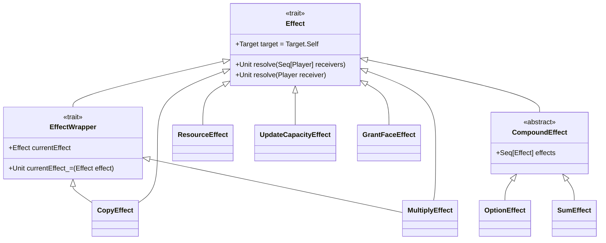
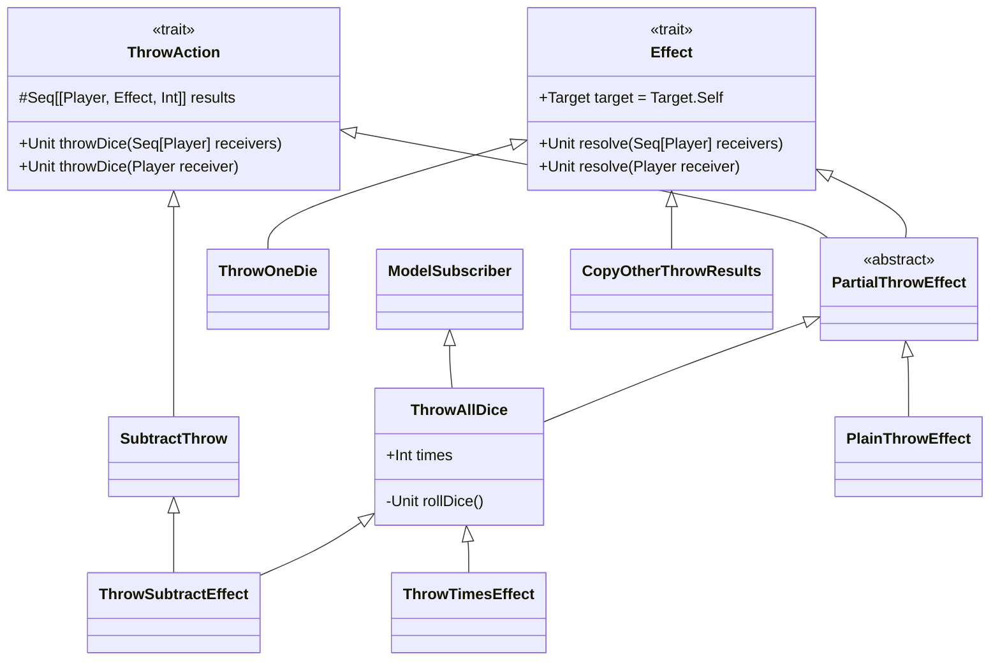
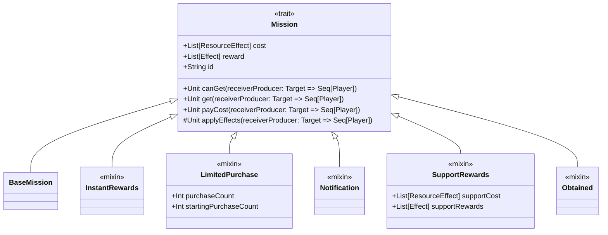
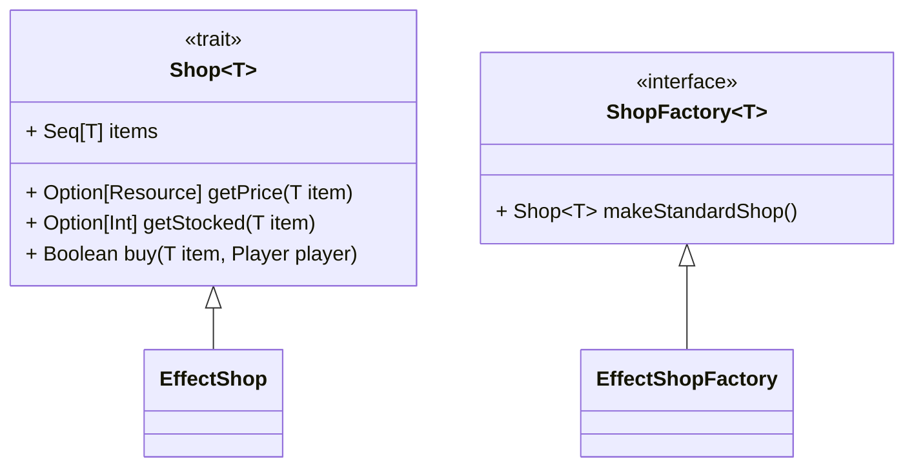
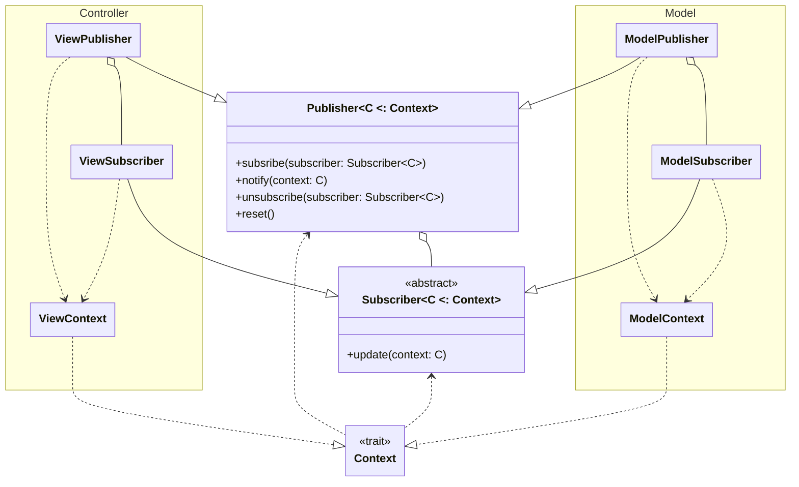
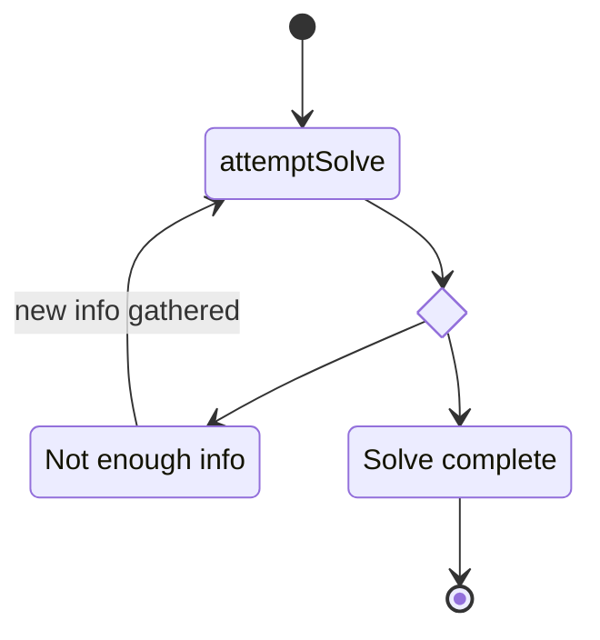
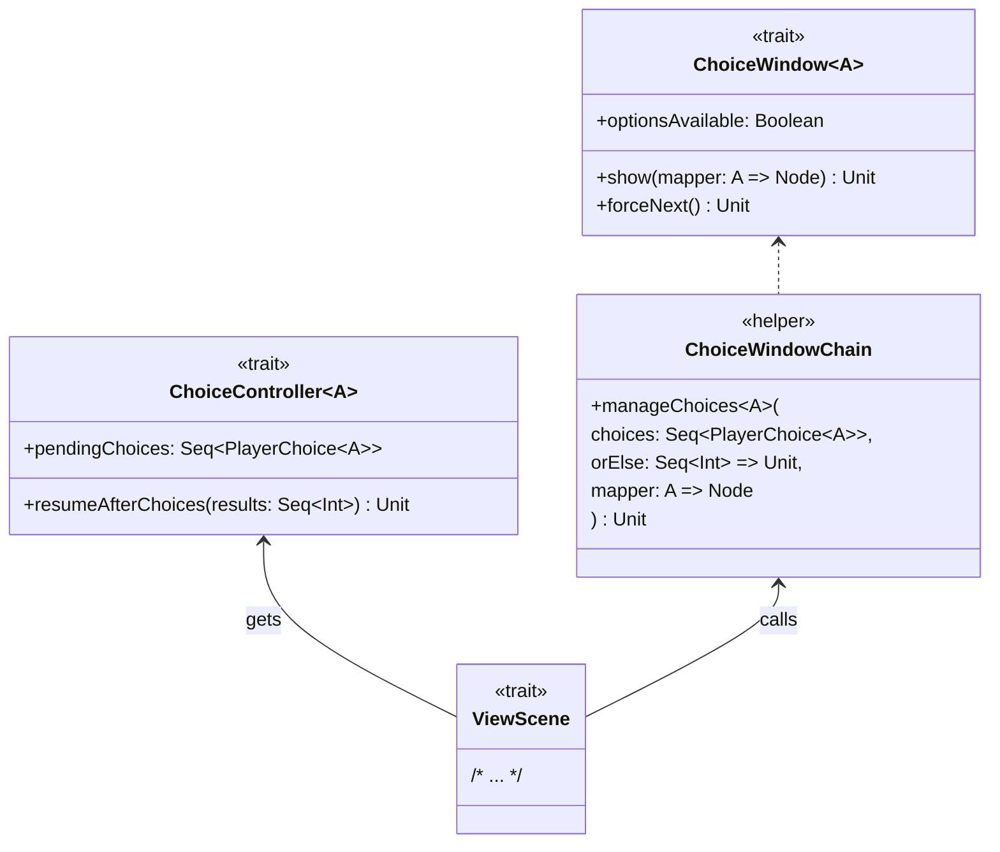

# 4. Design di dettaglio

## Elementi principali
Si effettua ora una breve descrizione degli elementi alla base del funzionamento del programma, che verranno descritti più
approfonditamente in seguito.

### Model
Analizzando i requisiti, ci si è resi conto che le ricompense delle missioni e le facce dei dadi operavano secondo principi
simili; è stato dunque deciso di riassumere entrambi i funzionamenti nel concetto di `Effect`, le istanze delle cui implementazioni
sarebbero state ricompense e costi delle missioni e facce dei dadi. Di conseguenza, lo `Shop` del gioco vende `Effect`. `GameManager` incapsula tutti gli elementi
che compongono una partita a Dice Forge, incluso il `TurnManager` per la gestione dei turni e il `MapManager` per l'individuazione della
posizione del giocatore sul tabellone delle missioni. Contiene anche una mappa di `Mission`, divise per casella, e la lista di `Player` della partita.
Ciascun `Player` ha al proprio interno un riferimento alla propria `PlayerBoard`, che contiene il conteggio delle `Resource`
a lui disponibili, ai propri due `Die`, e alle missioni che ha ottenuto.

### Controller
Ad ogni schermata della View corrisponde un Controller, che si occupa di fornire tutte le informazioni necessarie alla UI e di raccogliere
gli input degli utenti e trasmetterli al Model. A questi Controller accoppiati, se ne aggiungono due, `ControllerManager` che controlla lo Stage (ed ha quindi
il compito di cambiare la scena visualizzata), e `ControllerStage` per restituire il Controller necessario a quest'ultima. Una serie di DTO
è stata preparata per tradurre gli oggetti del Model in pacchetti di informazioni per la View, oscurandone l'implementazione. Il pattern Navigator, descritto
in seguito, è stato utilizzato per la navigazione di schermata in schermata. Il package `choices`, inoltre, contiene i Controller dedicati alle finestre di popup per le
varie scelte necessarie nel corso della partita.

### View
La view, scritta in _ScalaFX_, è composta da quattro schermate, ciascuna rappresentata da una `Scene`, un popup delle regole, e all'occorrenza un popup per le scelte. Il popup delle regole è
visualizzabile in qualsiasi momento nel menù principale o nel corso della partita, premendo il tasto "Regole". Il tema che l'applicazione doveva seguire è stato stabilito nel trait `Theme` e nella sua implementazione
`JfxTheme` per evitare che troppi colori rendessero l'interfaccia poco coesa e per permettere di cambiarli senza sostituirli manualmente in ogni elemento. Le `Factory` di `Button` e `Text` hanno la stessa funzione, riferita allo stile degli elementi che costruiscono.
L'object `LanguageStrings` contiene tutte le stringhe necessarie alla UI, eccetto quelle della rappresentazione delle missioni, che abbiamo scorporato per agevolarne l'eventuale cambiamento.

## Effect

L'effetto è stato uno dei primi concetti implementati. Il trait ha un metodo `resolve` che viene chiamato quando l'effetto va, appunto, risolto, ovvero quando avviene il completamento di una missione o quando vengono lanciati i dadi. Ciascun effetto eredita da `Effect`, ma per semplificare la fruizione dei diagrammi sono stati separati quelli che includono il lancio dei dadi da quelli che non lo prevedono.
`EffectWrapper` viene utilizzato dagli effetti che necessitano di un altro effetto su cui operare per essere risolti, mentre `CompoundEffect` è una sequenza di effetti su cui va effettuato uno stesso procedimento prima della risoluzione.

Ciascun effetto ha un `Target`, il cui valore può essere:
- `Self` se l'effetto viene applicato solo su chi lo attiva;
- `Others` se l'effetto viene applicato su tutti tranne chi lo attiva;
- `All` se l'effetto viene applicato su tutti.

## Mission

I tipi di missione principali individuati sono:
- `SupportMission`, l'implementazione delle missioni di rinforzo;
- `InstantMission`, l'implementazione delle missioni istantanee;
- `ObtainedMission`, la missione di supporto ottenuta che si trova nell'inventario del giocatore.

Questi tre tipi di missione sono stati creati per mezzo dei mixin nel diagramma sopra. Si è deciso di evitare di includere le classi stesse delle missioni per evitare la confusione data dalle frecce delle estensioni, ma se ne ritratterà nella sezione implementazione degli autori.

## Shop

Si è scelto di implementare `Shop` come generico sul tipo degli elementi nel proprio inventario, ma si è vincolato il prezzo degli item a `Resource` poiché si è ritenuto inverosimile, dopo aver analizzato i requisiti e le regole del gioco, che si potesse richiedere un pagamento in altra valuta.
La `ShopFactory` è stata implementata di conseguenza, e contiene solo la configurazione delle regole base del gioco.

## Publisher

Molte parti del sistema necessitano di scambiarsi messaggi l'una con l'altra, per esempio se dovessero cambiare le risorse di un giocatore bisognerebbe avvisare la view affinché mostri il valore corretto, ma bisogna anche fare in modo che si aggiornino le missioni disponibili all'acquisto a seconda del nuovo valore.
Per questo motivo si è optato per l'utilizzo del pattern Observer, con la struttura riportata di seguito

Il tipo C rappresenta il tipo di `Context` che viene gestito da `Publisher` e `Subscriber`.
Le varie parti del codice pubblicano eventi per mezzo del `Publisher`, il quale lo invia in modalità broadcast a tutti i suoi `Subscriber`, a questi ultimi definiscono le azioni da compiere per il dato `Context`.

Dato che nel sistema ci sono molte entità che possono generare eventi che interessano molti subscriber e che questi eventi si sovrappongono, rimanendo sul cambio di risorse questo può avvenire in vari contesti e in ognuno dei quali va ad interessare varie componenti della view, che si devono aggiornare di conseguenza. Per questo motivo si è optato per l'utilizzo del pattern Singleton per le implementazioni di `Publisher`, in particolare sono stati utilizzati `ModelPublisher` e `ViewPublisher` per la pubblicazione di tutti gli eventi del programma, si è optato per l'utilizzo di due `Publisher` per mantenere la separazione dettata da MVC.

## Navigator

Come abbiamo già spiegato per la realizzazione della GUI si è optato per l'utilizzo di scalaFX, tuttavia non si voleva creare una dipendenza forte da questa libreria. Per ovviare a questo problema abbiamo realizzato un sistema di navigazione tra le pagine che nascondesse il più possibile le classi di scalaFX al controller.
Il sistema è stato realizzato seguendo il seguente schema:

Si riporta una breve spiegazione:
- Tipi generici:
    - **T**: Il tipo base della libreria grafica(es: Node per JavaFx, Component per Java Swing).
    - **VS**: Il tipo sottoclasse di `ViewState` che viene accettato da `Navigator` e `ViewFactory`.
- Trait:
    - `ViewState`: Un  trait usato per denotare le classi che possono essere accettate da un `Navigator` o una `ViewFactory`.
    - `Navigator[VS]`: Ha il compito di gestire i cambi di `MainStage`.
    - `MainStage[T]`: Rappresenta il contenitore delle scene.
    - `ViewScene[T]`: Rappresenta una scena della view.
    - `ViewFactory[T, VS]`: Ha il compito di creare le scene concrete.
    - `ControllerManager`: Fornisce alla `ViewFactory` le dipendenze necessarie per creare le `ViewScene`
    - `ControllerStage[VS]`: Wrapper per la navigazione che permette di aggiungere altre operazioni al cambio di scena. Si tratta della classe che viene utilizzata dalla view per richiedere il cambio di scena.

Grazie a questa struttura possiamo gestire la View nascondendo il tipo concreto di T dal resto del controller, mantenendo il codice abbastanza flessibile da permettere l'aggiunta di nuove pagine se fosse necessario.

## Turn Manager

Per gestire al meglio quali azioni si possono eseguire nelle varie fasi del turno si è creato un `TurnManager` che permette di definire la macchina a stati del turno. A `TurnManager` si affiancano `TurnAction` e `TurnStep`:
- `TurnAction`: Definisce quali tipi di azioni sono presenti nel gioco, quando queste sono disponibili e a quali transizioni portano.
- `TurnStep`: Le fasi del turno, ovvero gli stati della macchina a stati.
  In questo modo abbiamo delegato il controllo dei permessi riguardanti le azioni al `TurnManager`.

## EffectManager
Quando vengono lanciati i dadi gli effetti ottenuti vanno risolti seguendo un ordine specifico che dipende dagli effetti stessi.
Inoltre alcuni effetti cambiano risultato a seconda degli altri effetti in gioco.
Per gestire la logica di risoluzione di più effetti abbiamo creato `EffectManager`,
che usa il pattern Singleton per essere facilmente accessibile da tutti i punti del codice
senza passarlo esplicitamente a tutti i componenti che ne hanno bisogno.
Inoltre `EffectManager` si appoggia a `Publisher` per avvisare della parziale risoluzione
nel caso in cui l'utente debba scegliere quale effetto attivare.

Nel diagramma è raffigurato il flusso semplificato della risoluzione degli effetti.
Ci sono più fasi interne in cui `EffectManager` può chiedere nuove informazioni,
e una volta ottenute riprova a risolvere gli effetti.
## ChoiceWindow
Nel gioco presentato esistono molte situazioni in cui per risolvere un'operazione è richiesto
l'intervento dell'utente nella forma di una scelta che cambierà il corso dell'operazione a seguire.
Per risolvere questo problema abbiamo creato `ChoiceWindow`, una finestra popup chiamata dalla view
per presentare agli utenti le scelte da eseguire e collezionare i risultati per la fase successiva dell'operazione.

## Schermate principali
### MainMenu

Nella schermata iniziale, si può scegliere di iniziare la partita o di consultare le regole, che compariranno come un popup.

### MatchInitScene

Nella schermata di configurazione della partita, si possono aggiungere fino a quattro giocatori, ciascuno con un colore diverso e un nome unico.

### BoardScene
#### Visione complessiva

Nell'immagine precedente, viene mostrato il tabellone di gioco con tutte le informazioni che contiene. In particolare vengono segnalate:
1. In alto a destra, troviamo il contatore dei turni e il tasto per consultare le regole, che attiva lo stesso popup del menu principale;
2. In basso troviamo le informazioni del giocatore attivo: a destra il risultato dell'ultimo tiro dei suoi due dadi (nel caso del giocatore Paolo, ha ottenuto Oro(1) da entrambi i dadi), a sinistra le risorse. Fuori dalla card del giocatore si trovano quattro tasti, che in ordine dall'alto al basso servono a: acquistare un'azione extra, visualizzare il negozio, passare il turno e mostrare le missioni di rinforzo possedute.
3. In alto a sinistra si trovano le card degli altri giocatori, contenenti le stesse informazioni di quella del giocatore attivo.
4. Le zone delimitate da un bordo arancione, che racchiudono due o tre missioni, sono le caselle del tabellone, descritte in seguito nel dettaglio.

#### Casella

Qui si vede da vicino una casella del tabellone, contenente una missione istantanea, "Spiriti Selvaggi," e una missione di rinforzo, "Anziano," differenziate per colore. L'immagine presenta i seguenti punti di interesse:
1. Il costo rappresentato è quello istantaneo della missione, ovvero quello che viene applicato al primo completamento: nel caso di entrambe queste missioni, il costo è di Cristalli Solari(1).
2. La ricompensa rappresentata è anch'essa quella del primo completamento, che può anche essere vuota, come mostrato nella missione "Anziano";
3. La descrizione delle missioni, necessaria per leggere gli effetti di rinforzo delle missioni di rinforzo, compare posizionando il puntatore sopra alla card della missione: nel caso della missione "Anziano," l'effetto di rinforzo consiste nello spendere Oro(3) per ottenere Punti Gloria(4);
4. Il contatore delle missioni ancora disponibili è visibile in basso nella card della missione;
5. Nella casella, qualora fosse presente, viene visualizzato un giocatore sotto forma di un pallino del colore associato ad esso. In questo esempio, il giocatore di colore blu si trova nella casella.

#### Negozio

Nel negozio, si possono acquistare facce a seconda della disponibilità. Ciascuna faccia costa una quantità di Oro. Le facce con un "+" permettono di ottenere tutti gli effetti mostrati insieme quando vengono ottenute come risultato sul dado, mentre le facce con un "?" richiedono di scegliere tra le opzioni raffigurate.

#### Effetti di rinforzo

All'inizio di ogni turno del giocatore, qualora egli avesse completato missioni di rinforzo, gli viene presentata questa schermata per permettergli di scegliere quali effetti di rinforzo attivare. Può anche rifiutare di attivarli premendo il tasto "Termina fase di rinforzo".

#### Popup di scelta

In alcuni casi, come quando il risultato del dado è un effetto Copia, Moltiplica o Opzione, oppure quando si compra una faccia del dado, verrà presentata una scelta al giocatore che ha attivato l'effetto. Il giocatore interpellato è scritto nel popup (in questo caso, Bruno). 

Nell'esempio, Bruno deve scegliere su quale dado posizionare la faccia appena acquistata. Si noti che questo è l'unico caso in cui la scelta viene effettuata tra i dadi: in tutti gli altri casi, la scelta è tra effetti.

### MatchEndScene

Nella schermata di fine partita, si visualizza la classifica finale e si può scegliere tra giocare ancora (e venire riportati alla configurazione) o uscire (ed andare al menù principale).

[Capitolo Precedente](ArchitecturalDesign.md) | [Indice](Index.md) | [Prossimo Capitolo](Implementation.md)