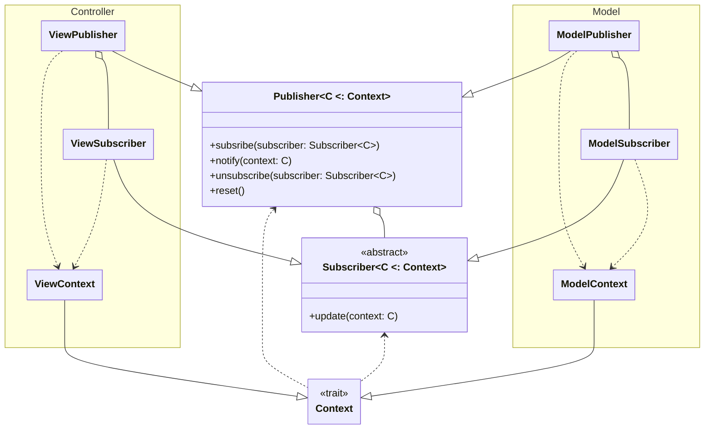
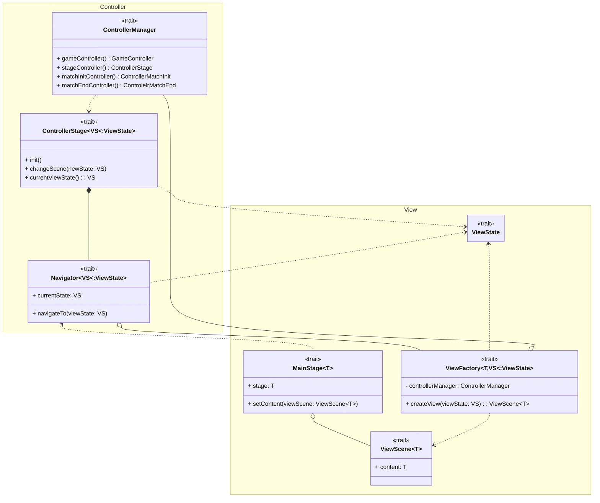
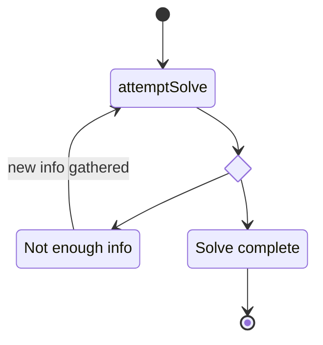
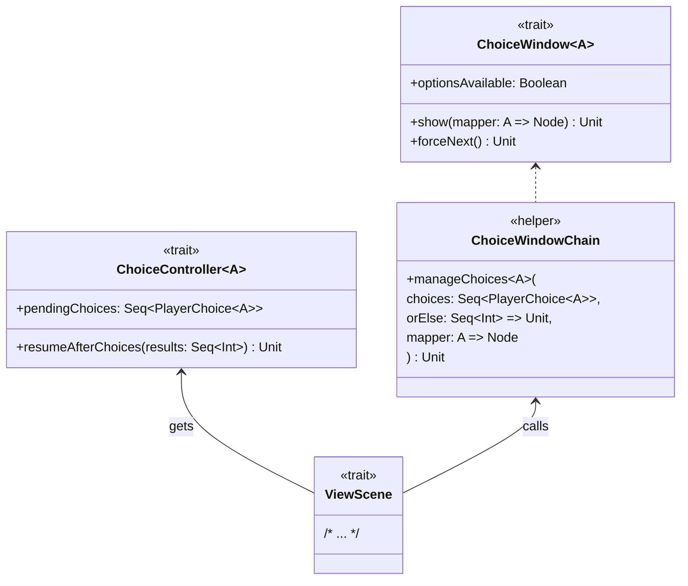

# Design di dettaglio

## Publisher

Problema: Molte parti del sistema hanno bisogno di comunicare tra di loro, ma senza un collegamento diretto. Per esempio quando vengono modificate delle risorse bisogna avvisare la view in modo che si aggiorni di conseguenza.
Soluzione: Questo è il caso perfetto per utilizzare il pattern Observer.

Di seguito una breve spiegazione del grafico.

Tipi generici:
- **C**: Rappresenta il sottotipo di `Context` accettato da `Subscriber` e `Publisher`
  Struttura:
  Si tratta di una implementazione del pattern Observer dove i `Subscriber` si possono mettere in ascolto in uno o più `Publisher` e i `Publisher` quando richiesto mandano in broadcast il dato contesto lasciando che siano i `Subscriber` a elaborare l'informazione.
  Dato che nel sistema ci sono molte entità che possono generare eventi che interessano molti subscriber e che questi eventi si sovrappongono, rimanendo sul cambio di risorse questo può avvenire in vari contesti e in ognuno di questi casi va ad interessare varie componenti della view che si devono aggiornare di conseguenza. Per questo motivo si è optato per l'utilizzo del pattern Singleton per il `Publisher`, in particolare si sono implementati `ModelPublisher` e `ViewPublisher` per la pubblicazione di tutti gli eventi del programma, si è optato per l'utilizzo di due `Publisher` per mantenere la separazione dettata dal MVC.

## Navigator

Come abbiamo già spiegato per la realizzazione della GUI si è optato per l'utilizzo di scalaFX, tuttavia non si voleva creare una dipendenza forte da questa libreria. Per ovviare a questo problema abbiamo realizzato un sistema di navigazione tra le pagine che nascondesse il più possibile le classi di scalaFX al controller.
Il sistema è stato realizzato seguendo il seguente schema:

Si riporta una breve spiegazione:
- Tipi generici:
    - **T**: Il tipo base della libreria grafica(es: Node per JavaFx, Component per Java Swing).
    - **VS**: Il tipo sottoclasse di `ViewState` che viene accettato da `Navigator` e `ViewFactory`.
- Trait:
    - `ViewState`: Un  trait usato per denotare le classi che possono essere accettate da un `Navigator` o una `ViewFactory`.
    - `Navigator[VS]`: Ha il compito di gestire i cambi di `MainStage`.
    - `MainStage[T]`: Rappresenta il contenitore delle scene.
    - `ViewScene[T]`: Rappresenta una scena della view.
    - `ViewFactory[T, VS]`: Ha il compito di creare le scene concrete.
    - `ControllerManager`: Fornisce alla `ViewFactory` le dipendenze necessarie per creare le `ViewScene`
    - `ControllerStage[VS]`: Wrapper per la navigazione che permette di aggiungere altre operazioni al cambio di scena. Si tratta della classe che viene utilizzata dalla view per richiedere il cambio di scena.

Grazie a questa struttura possiamo gestire la View nascondendo il tipo concreto di T dal resto del controller.

## EffectManager
Quando vengono lanciati i dadi gli effetti ottenuti vanno risolti seguendo un ordine specifico che dipende dagli effetti stessi.
Inoltre alcuni effetti cambiano risultato a seconda degli altri effetti in gioco.
Per gestire la logica di risoluzione di più effetti abbiamo creato `EffectManager`,
che usa il pattern Singleton per essere facilmente accessibile da tutti i punti del codice
senza passarlo esplicitamente a tutti i componenti che ne hanno bisogno.
Inoltre `EffectManager` si appoggia a `Publisher` per avvisare della parziale risoluzione
nel caso in cui l'utente debba scegliere quale effetto attivare.

Nel diagramma è raffigurato il flusso semplificato della risoluzione degli effetti.
Ci sono più fasi interne in cui `EffectManager` può chiedere nuove informazioni,
e una volta ottenute riprova a risolvere gli effetti.
## ChoiceWindow
Nel gioco presentato esistono molte situazioni in cui per risolvere un'operazione è richiesto
l'intervento dell'utente nella forma di una scelta che cambierà il corso dell'operazione a seguire.
Per risolvere questo problema abbiamo creato `ChoiceWindow`, una finestra popup chiamata dalla view
per presentare agli utenti le scelte da eseguire e collezionare i risultati per la fase successiva dell'operazione.

