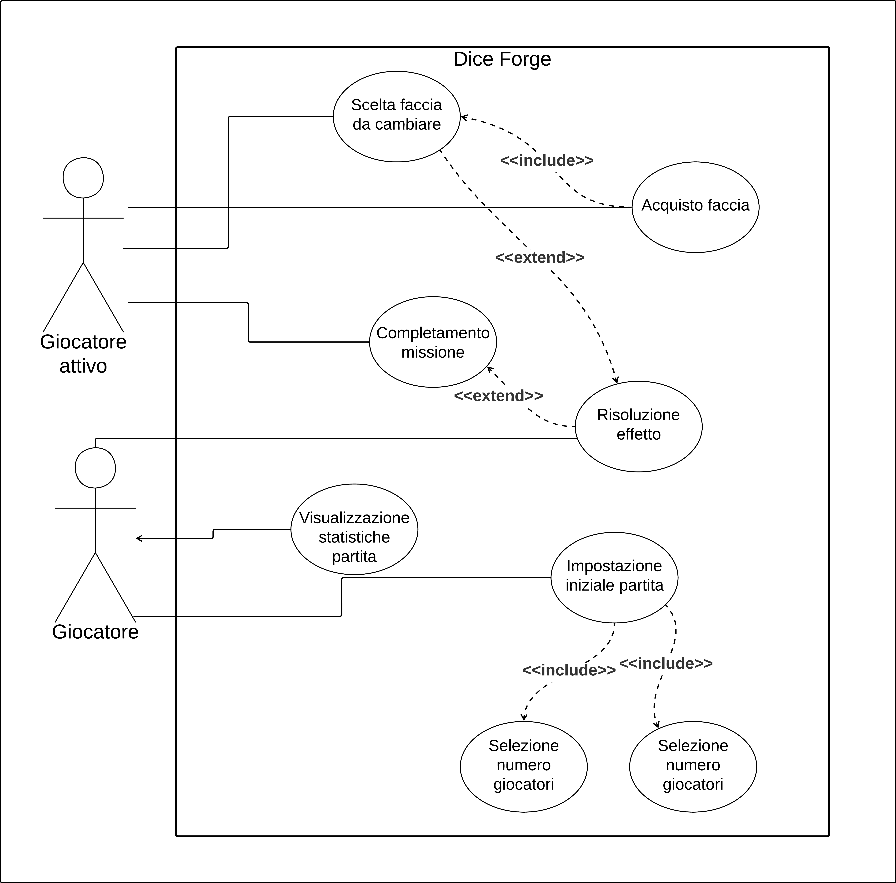

# 2. Requisiti
## Introduzione

Creare un porting del gioco da tavolo Dice forge basato sul linguaggio Scala.
Dice forge è un gioco dove i giocatori competono per ottenere il maggior numero di punti vittoria alla fine della partita.
Nel corso della partita tireranno i loro dadi per ottenere varie risorse che potranno usare per modificare i propri dadi o completare le missioni

### Terminologia

|     Termine      |                       Significato                       |
| :--------------: | :-----------------------------------------------------: |
|      Turno       | Momento in cui uno dei giocatori effettua le sue azioni |
|      Round       |         Un giro dei turni di tutti i giocatori          |
| Giocatore attivo |             Il giocatore del turno attuale              |

## Requisiti

### Business

- Creare un sistema in grado di poter effettuare una partita a una versione semplificata di Dice Forge.
- Permettere di giocare le partite da due a quattro giocatori, in modalità hotseat.

### Funzionali

#### Utente

- Gli utenti dovranno interagire con il sistema tramite un'interfaccia grafica(GUI).
- Gli utenti possono visualizzare i diversi fattori che rappresentano lo stato attuale della partita:
    - Il numero di Punti Vittoria attuali di ogni giocatore
    - Le risorse a loro disposizione
    - Le risorse a disposizione dei loro avversari
    - Le missioni disponibili
    - Le missioni da loro completate
    - Gli ultimi risultati dei dadi di tutti i giocatori
    - Le facce dei propri dadi
    - Le facce presenti nel negozio
    - Le eventuali missioni con effetti di rinforzo ottenute
- Gli utenti possono interagire con il sistema effettuando diverse azioni:
    - Impostare il numero di giocatori
    - Impostare il proprio nome
    - Impostare il proprio colore
    - Avviare la partita
    - Selezionare i bersagli dei loro effetti
    - Attivare i loro effetti di rinforzo ottenuti
    - Poter visualizzare gli effetti delle missioni prima di completarle
    - Completare le missioni
    - Interagire con il negozio
        - Visualizzare le facce disponibili
        - Acquistare facce da aggiungere ai propri dadi
    - Selezionare la faccia da sostituire quando se ne ottiene una nuova
    - Passare il turno

#### Sistema

- Una partita è composta da 9 o 10 round a seconda del numero di giocatori
    - 9 round per 2 o 4 giocatori
    - 10 round per 3 giocatori
- Ogni giocatore accumulerà risorse:
    - Oro: Utile per acquistare facce dal negozio
    - Cristalli solari: Utilizzati per Completare missioni ed effettuare azioni extra
    - Cristalli lunari: Utilizzati per Completare missioni
    - Punti Gloria: I punti vittoria del gioco, servono per determinare il vincitore
- Ogni giocatore ha un limite massimo alle risorse che può possedere, questo limite può essere aumentato.
  Il limite base per ogni risorsa è:
    - Oro: 12 unità
    - Cristalli Solari: 6 unità
    - Cristalli Lunari: 6 unità
    - Punti Gloria: Nessun limite
- Ogni giocatore ha a disposizione due dadi iniziali costruiti nel seguente modo:
    - Uno con 5 facce Oro e 1 faccia Cristallo solare, tutte di valore 1
    - Uno con 4 facce Oro di valore 1, 1 faccia Cristallo lunare di valore 1 e 1 faccia Punti vittoria di valore 2
- Ogni giocatore ottiene un valore di Oro iniziale in base all'ordine di turno:
    - Il primo giocatore ottiene 3 Oro
    - il secondo giocatore ottiene 2 Oro
    - l'eventuale terzo giocatore ottiene 1 Oro
    - l'eventuale quarto giocatore non ottiene Oro
- Durante ogni round ogni giocatore effettua un turno in ordine
- Il turno di un giocatore è suddiviso in 4 fasi:
    - Inizio: Tutti i giocatori tirano i propri dadi e attivano gli effetti che vi sono raffigurati
    - Rinforzo: Il giocatore attivo può attivare gli effetti di rinforzo delle sue carte
    - Azione Principale: Il giocatore attivo effettua un'azione
    - Azione Extra: Il giocatore attivo può effettuare un'azione aggiuntiva spendendo 2 cristalli solari
- Ci sono due tipi di azioni:
    - Comprare una faccia: consiste nel prendere una faccia dal negozio pagandone il costo e sostituirla a un altra faccia di uno dei due dadi del giocatore
    - Completare una missione: Il giocatore spende le risorse indicate dalla missione, poi se non vi si trova, si muove sulla casella della missione, e la ottiene attivandone eventuali effetti.
- Quando un giocatore vuole muoversi sulla casella di un altro giocatore questo viene riportato alla zona di partenza e ottiene un tiro di dadi bonus.
- Le 15 missioni sono suddivise in base al costo su 7 caselle nel seguente modo:
    - 2 missioni da 1 Cristallo solare
    - 1 missione da 2 Cristalli solari e 1 missione da 3 Cristalli solari
    - 1 missione da 4 Cristalli solari e 1 missione da 5 Cristalli solari
    - 2 missioni da 1 Cristallo lunare
    - 1 missione da 2 Cristalli lunari e 1 missione da 3 Cristalli lunari
    - 1 missione da 4 Cristalli lunari e 1 missione da 5 Cristalli lunari
    - 1 missione da 6 Cristalli solari, 1 missione da 6 Cristalli lunari e 1 missione da 5 Cristalli solari + 5 Cristalli lunari
- Nel gioco sono presenti 15 missioni suddivise in tre categorie,
  riportate secondo la seguente struttura: Nome: \[Costo] => \[Ricompensa]
    - Nessun effetto: il giocatore ottiene solo Punti Gloria.
        - Traghettatore: \[4 Cristalli lunari] => \[12 Punti Gloria]
        - Gorgone: \[4 Cristalli solari] => \[14 Punti Gloria]
        - Idra: \[5 Cristalli solari, 5 Cristalli lunari] => \[26 Punti Gloria]
    - Effetto immediato: applicano il proprio effetto appena vengono completate.
        - Forziere del fabbro: \[1 Cristallo lunare] => \[2 Punti Gloria, +4 Capacità massima di Oro, + 3 Capacità massima di Cristalli solari e lunari]
        - Satiri: \[3 Cristalli lunari] => \[6 Punti Gloria, Tutti gli altri giocatori tirano i propri dadi, ma non ne applicano gli effetti. Il giocatore attivo sceglie due facce tra tutte quelle ottenute dai suoi avversari e ne applica gli effetti]
        - Elmo dell'invisibilità: \[5 Cristalli lunari] => \[4 Punti Gloria, Il giocatore ottiene una faccia "Risultato per 3" da applicare ad uno dei propri dadi]
        - Spiriti Selvaggi: \[1 Cristallo solare] => \[2 Punti Gloria, 3 Oro, 3 Cristalli lunari]
        - Minotauro: \[3 Cristalli solari] => \[8 Punti Gloria, Tutti gli altri giocatori tirano i propri dadi e ne applicano gli effetti, ma nel caso in cui dovessero ottenere risorse(inclusi Punti Gloria) invece ne perdono lo stesso ammontare]
        - Specchio dell'abisso: \[5 Cristalli solari] => \[10 Punti Gloria, Il giocatore ottiene una faccia "Copia" da applicare ad uno dei propri dadi]
        - Sfinge: \[6 Cristalli solari] => \[10 Punti Gloria, Il giocatore attivo tira uno dei propri dadi 4 volte di fila e ne ottiene i risultati]
        - Scorpione: \[6 Cristalli lunari] => \[8 Punti Gloria, Il giocatore attivo tira entrambi i propri dadi due volte e ne ottiene i risultati]
    - Effetto di Rinforzo: Oltre al fornire Punti Gloria non hanno altri effetti appena vengono acquistati, ma il giocatore le ottiene e può attivarne il loro effetto durante la fase di rinforzo.
      Vengono riportarte nel seguente modo \[Costo] => \[Punti Gloria, \[Eventuale Costo di Rinforzo] => \[Ricompensa del Rinforzo]]
        - Martello del fabbro: \[1 Cristallo lunare] => \[0 Punti Gloria, \[12 Oro] => \[17 Punti Gloria]]
        - Cerva d'argento: \[2 Cristalli lunari] => \[2 Punti Gloria, \[] => \[Il giocatore tira uno dei propri dadi e ne applica gli effetti]]
        - Anziano: \[1 Cristallo solare] => \[0 Punti Gloria, \[3 Oro] => \[ 4 Punti Gloria]]
        - Gufo del guardiano: \[2 Cristalli solari] => \[4 Punti Gloria, \[] => \[Il giocatore ottiene 1 di una risorsa scelta tra Oro, Cristalli solari e Cristalli lunari]]
- Ogni missione può essere completata un numero di volte pari al numero di giocatori.
- I giocatori possono personalizzare i propri dadi con le facce che ottengono durante il gioco. Queste si dividono in tre categorie:
    - Standard: forniscono un tipo di risorsa.
        - Oro: forniscono 1, 3, 4 o 6 Oro
        - Cristalli solari: forniscono 1 o 2 Cristalli solari
        - Cristalli lunari: forniscono 1 o 2 Cristalli lunari
        - Punti Gloria: forniscono 2, 3 o 4 Punti Gloria
    - Ibride: forniscono molteplici tipi di risorse o danno una scelta su più risorse.
        - Opzione a tre: il giocatore sceglie tra Oro, Cristalli solari o Cristalli lunari e ne ottiene 1 o 2
        - Somma oro e lunare: Fornisce 2 Oro e 1 Cristallo lunare
        - Somma Punti Gloria e solare: Fornisce 1 Punto Gloria e 1 Cristallo solare
        - Opzione oro o Punti Gloria: Fornisce 3 Oro o 2 Punti Gloria
        - Somma a quattro: Fornisce 1 di Oro, Cristalli solari, Cristalli lunari e Punti Gloria
        - Somma Punti Gloria e lunari: Fornisce 2 Punti Gloria e 2 Cristalli lunari
    - Speciali:
        - Risultato per 3: Triplica il valore in risorse del risultato dell'altro dado. In caso l'altra faccia sia un altro "Risultato per 3" allora non fornisce niente.
        - Copia: Copia l'effetto di una faccia che un avversario ha ottenuto con un dado. Nel caso in cui il risultato sia "Copia" + "Risultato per 3" si risolve prima l'effetto di "Copia".
- I giocatori possono acquistare facce dal negozio. Queste sono divise in categorie in base al costo in Oro:
    - Costo 2:
        - 4 facce Cristalli lunari di valore 1
        - 4 facce Oro di valore 1
    - Costo 3:
        - 4 facce Cristalli solari di valore 1
        - 4 facce Oro di valore 4
    - Costo 4:
        - 1 faccia Somma oro e lunare
        - 1 faccia Oro di valore 6
        - 1 faccia Opzione a tre di valore 1
        - 1 faccia Somma punti vittoria e solare
    - Costo 5:
        - 4 facce Opzione oro o punti vittoria
    - Costo 6:
        - 4 facce Cristallo lunare di valore 2
    - Costo 8:
        - 4 facce Cristallo solare di valore 2
        - 4 facce Punti vittoria di valore 3
    - Costo 12:
        - 1 faccia Opzione a tre di valore 2
        - 1 faccia Somma a quattro
        - 1 faccia somma punti vittoria e lunari
        - 1 faccia Punti vittoria di valore 4
- Alla fine dell'ultimo round il giocatore con più punti vittoria viene dichiarato il vincitore.
- In caso di pareggio tutti i giocatori che hanno pareggiato vincono insieme.

### Non Funzionali

- Realizzazione di software in grado di essere facilmente ampliabile, in termini di aggiunta di nuove opzioni per facce e missioni.

### Implementazione

- Utilizzo di Scala 3.x

Di seguito riportiamo lo schema dei casi d'uso:

[Capitolo Precedente](DevelopmentProcess.md) | [Indice](Index.md) | [Prossimo Capitolo](ArchitecturalDesign.md)