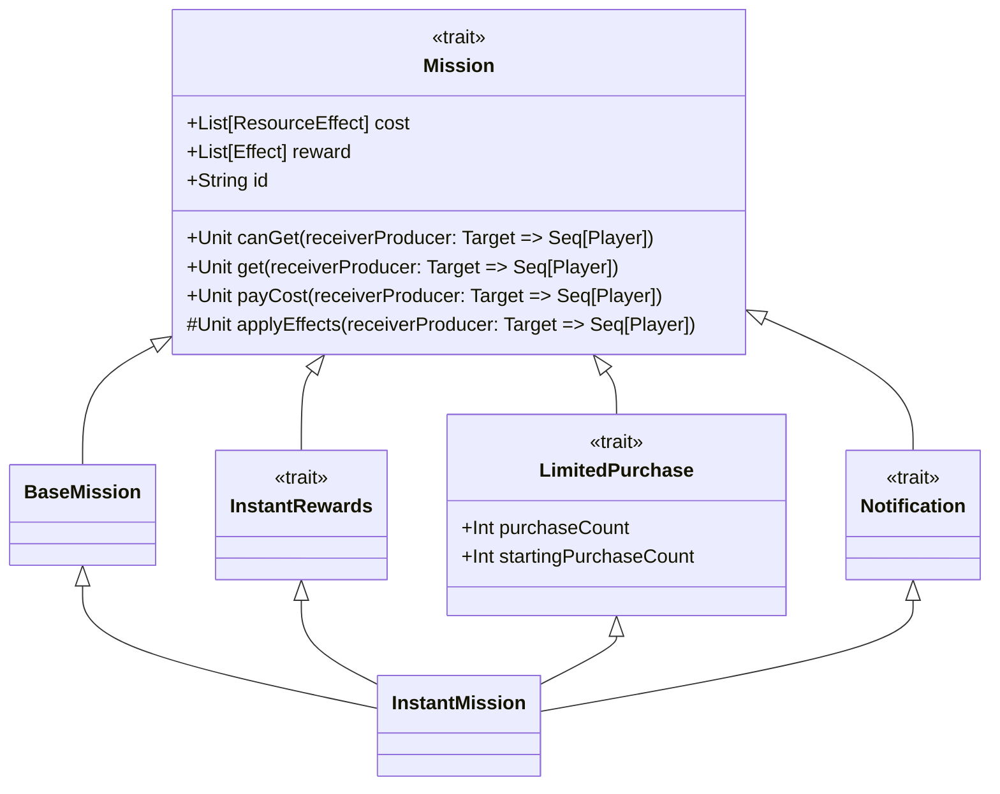

# Giulia Bonifazi - Implementazione

In veste di sviluppatore, mi sono occupata di implementare:
- le missioni base e istantanee, e la loro visualizzazione sull'interfaccia della partita, compreso il tabellone su cui si trovano; successive modifiche sono state applicate da Galileo Foschini per agevolare l'implementazione delle missioni di rinforzo e da Lorenzo Dalmonte per aggiungere il contatore di missioni disponibili;
- insieme a Lorenzo Dalmonte e Galileo Foschini, gli effetti delle missioni e delle facce dei dadi;
- la logica del dado, sempre con contributi minori di Lorenzo Dalmonte;
- il negozio;
- le utilities della View;
- l'estrattore di path per gli sprite e lo Sprite stesso;
- la prima versione di ControllerStage, in modo da poter testare la View prima che il navigator venisse aggiunto.

In seguito esporrò gli aspetti significativi di queste implementazioni.

## L'implementazione di Effect
Ho scelto di implementare il tratto `Effect` con un singolo metodo resolve, in modo che fosse possibile chiamarlo senza curarsi di quale tipo di effetto si stesse gestendo. I miei colleghi hanno aggiunto il metodo target, per permettere al ricevente/i dell'effetto di essere individuati nel momento della risoluzione:
```scala
trait Effect:  
  /**  
   * Resolves the effect on the receivers   * @param receivers the receivers  
   */  def resolve(receivers: Seq[Player]): Unit = receivers.foreach(resolve)  
  
  /**  
   * Resolves the effect on a single receiver   * @param receiver the receiver  
   */  def resolve(receiver: Player): Unit  
  
  /**  
   * @return the target of the effect, Self by default  
   */  def target: Target = Self
```
In particolare, mi sono occupata di `ResourceEffect`, `UpdateCapacityEffect`, `ThrowSubtractEffect` e `ThrowTimesEffect`.
## ResourceEffect
Nei requisiti è esplicitato che a volte è necessario che effetti che normalmente aggiungono risorse vadano invece a toglierle. A questo scopo, ResourceEffect permette di modificare il modulo attraverso il quale viene effettuata l'operazione sulla risorsa che contiene:
```scala
case class ResourceEffect(resource: Resource, override val target: Target, private var module: ResourceEffectModule = AddResource) extends Effect:  
  override def resolve(receiver: Player): Unit = module.apply(receiver.board, resource)  
  def setModule(mod: ResourceEffectModule): Unit = module = mod
```
In questo modo è possibile reimpostarlo prima della risoluzione, come accade nel metodo `setModuleOnce` dell'`EffectManager` scritto dal mio collega.

## ThrowAction
Essendoci molti effetti che richiedevano tiri di dado, ho ritenuto opportuno dedicare un altro trait a questo scopo, `ThrowAction`:
```scala
trait ThrowAction:  
  /**  
   * @return the (player, result, index of die) tuple of the most recent dice throw  
   */  protected def results: Seq[(Player, Effect, Int)]  
  
  /**  
   * throw the dice of the selected player   * @param receiver the player  
   */  def throwDice(receiver: Player): Unit  
  
  /**  
   * throw the dice of the selected players   * @param receivers the players  
   */  def throwDice(receivers: Seq[Player]): Unit = receivers.foreach(throwDice)
```
L'implementazione della classe ThrowAllDice, in collaborazione con Lorenzo Dalmonte, ha permesso la creazione dei due effetti di mia competenza. In particolare, ecco mixin e dichiarazione di ThrowSubtractEffect:
```scala
trait SubtractThrow extends ThrowAction:  
  /**  
   * Sets the resulting effects of the throw so they subtract resources instead of adding them   * @param receiver the player  
   */  abstract override def throwDice(receiver: Player): Unit =  
    super.throwDice(receiver)  
    EffectManager().setModuleOnce(SubtractResource)  
    results.foreach((_, e, _) => e match  
      case r: ResourceEffect => r.setModule(SubtractResource)  
      case _ =>  
    )
    
class ThrowSubtractEffect(times: Int = 1, target: Target = Self) extends ThrowAllDice(times, target) with SubtractThrow
```

## Il trait Mission e i suoi mixin

Durante la prima implementazione del concetto di Missione, mi sono accorta che ogni missione aveva alla base uno stesso funzionamento:
- quando la missione viene attivata, comprandola o riscattandone l'effetto di rinforzo, applica il proprio costo;
- la ricompensa consiste in una serie di effetti che vengono applicati al proprietario della missione.
  Ho quindi implementato una prima versione del trait `Mission`, che nella sua versione finale è il seguente:
```scala
trait Mission:  
  /**  
   * Returns the instant reward of the mission   * @return A list of effects that are the rewards of the mission  
   */  def reward: List[Effect]  
  
  /**  
   * Returns the instant cost of the mission   * @return The list of costs of the mission  
   */  def cost: List[ResourceEffect]  
  
  /**  
   * @return the id of the mission  
   */  def id: String  
  
  /**  
   * @param receiverProducer producer of the players that need to check   
* @return whether the receivers can complete the mission  
   */  def canGet(receiverProducer: Target => Seq[Player]): Boolean =  
    cost.forall { e =>  
      val players = receiverProducer(e.target)  
      players.nonEmpty && players.forall(_.board.canSpend(e.resource))  
    }  
  
  /**  
   * Awards the players with the mission effects and subtracts the cost   * @param receiverProducer the receivers producer  
   */  final def get(receiverProducer: Target => Seq[Player]): Unit =  
    if canGet(receiverProducer) then  
      payCost(receiverProducer)  
      applyEffects(receiverProducer)  
  
  /**  
   * Subtracts the cost of the mission from the targets' board   * @param receiverProducer the receivers producer  
   */  protected def payCost(receiverProducer: Target => Seq[Player]): Unit =  
    cost.foreach(r => {  
      r.setModule(model.utils.ResourceEffectModules.SubtractResource)  
      r.resolve(receiverProducer(r.target))  
    })  
  
  /**  
   * Applies the reward effects to produced players.   * @param receiverProducer the receivers producer  
   */  protected def applyEffects(receiverProducer: Target => Seq[Player]): Unit
```

-`id` indica il tipo di missione, impostato alla costruzione nella MissionFactory e necessario per derivarne il titolo e la descrizione nell'interfaccia;
- `reward` restituisce la lista degli effetti che corrispondono alla ricompensa del completamento della missione;
- `cost` restituisce la lista degli effetti che corrispondono al costo per completare la missione;
- `canGet` restituisce un Boolean che indica se il giocatore selezionato possiede i fondi necessari a completare la missione;
- `get` si occupa della logica del completamento della missione: il comportamento base è che viene applicato il costo, poi gli effetti ricompensa;
- `payCost`, come comportamento base, risolve tutti gli effetti del costo;
- `applyEffects`, come comportamento base, risolve tutti gli effetti della ricompensa.
  Ho quindi implementato la case class `BaseMission` in modo che fosse la base da cui estendessero tutte le altre. Ho scelto di renderla una case class per agevolare il pattern matching nel Model.

```scala
case class BaseMission(reward: List[Effect], cost: List[ResourceEffect], id: String = "placeholder") extends Mission:  
  override protected def applyEffects(receiverProducer: Target => Seq[Player]): Unit = {}
```

Questa prima implementazione ha reso possibile l'utilizzo di mixin, che combinati tra loro hanno composto le tre classi di missioni principali. Io in particolare ho implementato la InstantMission, attraverso l'estensione di BaseMission con il mixin InstantRewards, mostrato sopra nel diagramma di classe e in seguito sotto forma di codice:

```scala
trait InstantRewards extends Mission:  
  /**  
   * Applies the rewards immediately upon completion of the mission   * @param receiverProducer the receivers producer  
   */  abstract override def applyEffects(receiverProducer: Target => Seq[Player]): Unit =  
    super.applyEffects(receiverProducer)  
    reward.foreach(r => r.resolve(receiverProducer(r.target)))
    
class InstantMission(reward: List[Effect], cost: List[ResourceEffect], id: String = "placeholder", startCount: Int = 4)  
  extends BaseMission(reward, cost, id) with InstantRewards with LimitedPurchase(startCount) with Notification
```

Notare appunto come sia stato possibile ai miei colleghi aggiungere i propri mixin alla mia implementazione senza modificarla ulteriormente e senza mettere mano al codice in cui viene utilizzata.

## ImagePathFinder e i given
Ciascun effetto ha un proprio sprite, e mi sono occupata di implementare il modulo che contiene il metodo per estrarre il percorso file corretto. Al fine di fare questo, ho sfruttato i given di Scala in modo da poter scrivere varie implementazioni dello stesso metodo, senza esporne più di una forma:
```scala
trait ImagePathFinder[T]:  
  protected val spritePath: String = Paths.spritePath  
  
  /**  
   * Returns the sprite path, formatted for jar navigation, of the selected element   *   * @param element the element whose sprite we have to find  
   * @return the sprite path  
   */  def getPath(element: T): String  
  
object ImagePathFinders:  
  
  def findImagePath[T: ImagePathFinder](element: T): String = summon[ImagePathFinder[T]].getPath(element)
```
In questo modo, ho potuto implementare un metodo personalizzato per ciascun oggetto di classe T che ne necessitasse, nel nostro caso `Effect` e `Resource`. Si offre in esempio l'implementazione per `Resource`:
```scala
given ImagePathFinder[Resource] with  
  
  override def getPath(element: Resource): String = element match  
    case Gold(_) => spritePath + "gold.png"  
    case GloryPoint(_) => spritePath + "glory_point.png"  
    case SunCrystal(_) => spritePath + "sun.png"  
    case MoonCrystal(_) => spritePath + "moon.png"  
    case _ => spritePath + "placeholder.png"
```