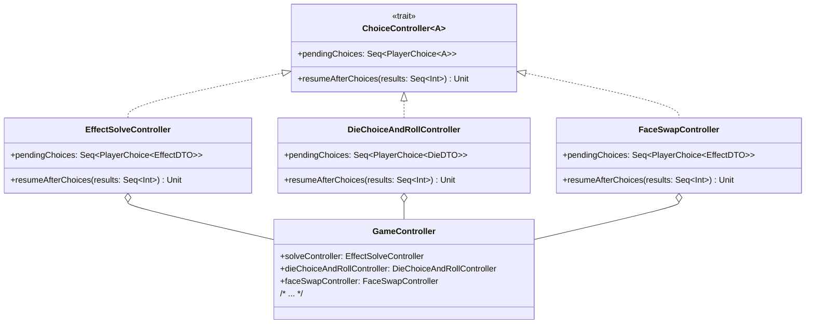

# Lorenzo Dalmonte - Implementazione
In questo progetto ho contribuito individualmente all'implementazione delle risorse,
alla risoluzione in massa degli effetti dei dadi, e alla gestione di scelte da parte
del giocatore tramite popup nel gioco. Inoltre ho contribuito ad alcune parti
dei miei colleghi, spesso solo piccole modifiche per mitigare problemi trovati
in fase di testing o per aggiungere funzionalità utili scoperte in fase di sviluppo.
Di seguito sono riportati i dettagli implementativi più degni di nota nel mio codice.

## Resource
Tutti i tipi di risorsa specifici nel gioco sono implementati con record immutabili
che implementano il trait `Resource`. Tale trait tiene traccia della quantità
di una risorsa e fornisce un metodo `copy` per creare una nuova risorsa dello stesso tipo.
Tale metodo è fondamentale per implementare operazioni fra `Resource` compatibili
con qualunque oggetto che implementa `Resource`, fra cui la somma e differenza di due risorse.
```scala
object Resource:
  def unapply(resource: Resource): Option[Int] =
    Some(resource.amount)

  extension (r1: Resource)
    private def applyFun(r2: Resource, fun: (Int, Int) => Int): Resource =
      val positiveFun: (Int, Int) => Int = (first, second) => math.max(fun(first, second), 0)
      if r1 == r2.copy(r1.amount)
      then r1.copy(positiveFun(r1.amount, r2.amount))
      else r1

    def +(r2: Resource): Resource = r1.applyFun(r2, _ + _)
    def -(r2: Resource): Resource = r1.applyFun(r2, _ - _)
    def *(multiplier: Int): Resource =
      if multiplier > 1 then r1 + (r1 * (multiplier - 1)) else r1
```
Il concetto di limite massimo di una risorsa è separato dal concetto di risorsa base
e catturato dal trait `ResourceWithCap`. L'implementazione effettiva sfrutta
il pattern Decorator, quindi estende `Resource` e si appoggia a un'altra risorsa data
a costruzione per calcolare la quantità della risorsa tenendo conto del limite massimo stabilito.
```scala
trait ResourceWithCap extends Resource:
  /**
   *
   * @return the max amount allowed for this resource
   */
  def maxCapacity: Int

  /**
   * Sets the capacity of this resource
   * @param newCapacity the new cap for this resource
   */
  def maxCapacity_=(newCapacity: Int): Unit

  /**
   *
   * @return the capped resource
   */
  def resource: Resource

object ResourceWithCap:
  private class ResourceWithCapImpl(var _resource: Resource, initCapacity: Int) extends ResourceWithCap:
    private var _maxCapacity = initCapacity

    override def maxCapacity: Int = _maxCapacity

    override def maxCapacity_=(newCapacity: Int): Unit =
      if newCapacity > 0
      then
        _resource = _resource.copy(this.amount)
        _maxCapacity = newCapacity

    override def amount: Int = math.min(_resource.amount, _maxCapacity)

    override def copy(amount: Int): Resource = ResourceWithCapImpl(_resource, _maxCapacity)

    override def resource: Resource = _resource.copy(this.amount)

  def apply(resource: Resource, initCapacity: Int): ResourceWithCap =
    ResourceWithCapImpl(resource, initCapacity)

  extension (r1: ResourceWithCap)
    def +(r2: Resource): ResourceWithCap = ResourceWithCap(r1.resource + r2, r1.maxCapacity)
    def -(r2: Resource): ResourceWithCap = ResourceWithCap(r1.resource - r2, r1.maxCapacity)
```

## EffectManager
`EffectManager` è l'oggetto che si occupa della risoluzione di un insieme di effetti
a volte legati fra loro. Questo oggetto è un singleton per renderlo facilmente accessibile
da tutti i punti del codice, fra cui `Effect` e `GameController`.
Fra i metodi esposti ci sono `attemptSolve` e `effectsToSolve`. Il primo riceve degli effetti
legati ai giocatori e prova a risolverli tutti in fasi separate a seconda dei tipi di effetto.
Se arriva in fondo comunica la riuscita della risoluzione, altrimenti salva internamente
gli effetti non rilevanti per la fase corrente e comunica la necessità di un intervento esterno
per specificare cosa faranno gli effetti variabili. Anche tali effetti sono salvati in `EffectManager`
e sono accessibili tramite `effectsToSolve`. Infine `EffectManager` fornisce il metodo `updateTurnEffects`
per aggiornare gli effetti correnti senza attivarli, e il metodo `setModuleOnce` per specificare un modulo
di risoluzione dei `ResourceEffects` da applicare per la prossima risoluzione.

## ChoiceController
Uno dei problemi riscontrati nel progetto è stato la gestione di scelte da parte dell'utente
che devono interrompere un'operazione e riprenderla una volta ottenuti i risultati.
Il trait `ChoiceController` è stato pensato per risolvere tale problema insieme a `ChoiceWindow` nella view.
`ChoiceController` permette di leggere le scelte in attesa e di riprendere l'esecuzione
dell'operazione prendendo in considerazione i risultati dati dall'utente.

Tale trait è generico sul tipo degli elementi fra cui l'utente deve scegliere,
il che lo rende facilmente adattabile a diverse implementazioni, per esempio `EffectSolveController`,
il quale è collegato a `EffectManager`. Esso ha quindi accesso agli effetti non risolti
e può richiamare `EffectManager` con i nuovi risultati dall'utente per concludere la risoluzione.
```scala
object EffectSolveController:
  private class EffectSolveControllerImpl extends ChoiceController[EffectDTO]:
    private val effectManager = EffectManager()
    private var choiceList: Seq[(Player, Seq[Effect])] = Seq.empty

    override def pendingChoices: Seq[PlayerChoice[EffectDTO]] =
      choiceList = effectManager.effectsToSolve.map((p, opt) => (p, opt.effects))
      choiceList.map((p, effects) => (PlayerDTO(p), effects.map(EffectDTO(_))))

    override def resumeAfterChoices(results: Seq[Int]): Unit =
      effectManager.attemptSolve(results.zip(choiceList).map((index, choice) => (choice._1, choice._2(index))))

  def apply(): ChoiceController[EffectDTO] = EffectSolveControllerImpl()
```


[Torna a Implementazione](../Implementation.md) | [Indice](Index.md)