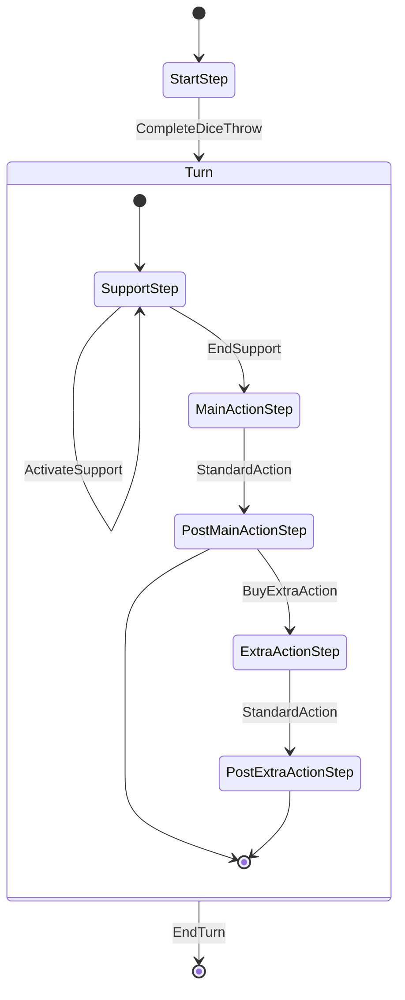

# Galileo Foschini - Implementazione

Oltre che da programmatore il mio ruolo nel progetto è stato quello di esperto di dominio, in quanto ero la persona più familiare con il gioco proposto.
Dal punto di vista implementativo ho collaborato con i mie colleghi in tutte le fasi del progetto, come spiegato di seguito, ma mi sono anche occupato di alcune parti in autonomia.

## Navigator

Ho avuto il compito di implementare le classi relative al Navigator.
Per lo schema completo vedere [Design di dettaglio: Navigator](../DetailedDesign.md#Navigator)

Di seguito riporto le implementazioni delle classi più importanti:

**Navigator**:
```scala
private class NavigatorImpl[T, VS <: ViewState](mainStage: MainStage[T], viewSceneFactory: ViewSceneFactory[T, VS]) extends Navigator[VS]:

    override def navigateTo(viewState: VS): Unit =
	    mainStage.setContent(viewSceneFactory.createScene(viewState))
```

L'implementazione dell'interfaccia navigator è costituita in modo che il navigator non conosca se non dopo al creazione il tipo di T inoltre questo tipo viene nascosto dall'interfaccia.

**ControllerManager**:
Il `ControllerManager` si occupa della creazione e gestione dei controller principali, nel nostro caso si occupa anche della creazione del `Navigator`.
```scala
private class ControllerManagerImpl[T](
                                          mainStageProvider: () => MainStage[T],
                                          viewSceneFactoryProvider: ControllerManager => ViewSceneFactory[T, StandardViewState]
                                        ) extends ControllerManager:
	//Codice
	override val stageController: ControllerStage[StandardViewState] =
      ControllerStage(Navigator(mainStageProvider(), viewSceneFactoryProvider(this)), StandardViewState.MainMenu)
    //Codice
```

`ControllerStage` è il controller dedicato alla gestione delle azioni necessarie prima del cambio di scena, il quale viene delegato al `Navigator`. Da notare che con questa implementazione, che sfrutta `mainStageProvider` e `viewSceneFactoryProvider`, il tipo di T è noto alla classe solo a runtime quando viene creata:

```scala
object MainApp extends JFXApp3 {
  override def start(): Unit = {
    val mainStage: FxMainStage = FxMainStage()
    val controllerManager: ControllerManager =
      ControllerManager(
        () => mainStage,
        controller => FxSceneFactory(controller)
      )
    controllerManager.stageController.init()
    FxPopup.setOwner(mainStage.primaryStage)
    stage = mainStage.primaryStage
  }
}
```

## MapManager

Nel gioco la posizione dei giocatori viene gestita in modo molto semplice, come detto nei requisiti ci sono 7 caselle su cui può esserci un solo giocatore alla volta. Nel caso un altro giocatore voglia spostarsi su di una casella occupata allora il giocatore presente torna alla posizione di partenza e ottiene n tiro di dadi bonus.

**MapManager**:
```scala
private class MapManagerImpl(onMove: () => Unit, onThrowOut: Player => Unit) extends MapManager:
    private var map: Map[Int, Player] = Map.empty

    override def playerPositions: Map[Int, Player] = map

    override def playerInPosition(position: Int): Option[Player] = map.get(position)

    override def movePlayer(player: Player, newPosition: Int): Unit =
      playerInPosition(newPosition) match
        case Some(playerToBeRemoved) if player != playerToBeRemoved =>
          onThrowOut(playerToBeRemoved)
          map = map.filter((_, p) => p != playerToBeRemoved)
        case _ =>
      map = map.filter((_, p) => p != player).updated(newPosition, player)
      onMove()
```

Sfruttando i tipi funzionali di scala ho potuto separare la logica del movimento e le azioni che ne conseguono.
- Grazie ad `onMove` definiamo le azioni da compiere dopo il movimento
- Grazie a `onThrowOut` definiamo quello che succede al giocatore che viene espulso dalla propria casella.

Questi ulteriori comportamenti vengono definiti in fase di creazione:
```scala
private val mapManager: MapManager = MapManager(
      () => ModelPublisher().notify(ModelContext.PlayerMovedContext),
      player =>
        EffectManager().updateTurnEffects(player.dice.zipWithIndex.map((d, i) => (player, d.roll, i)))
        EffectManager().attemptSolve(player.dice.map(d => (player, d.lastRolledEffect.get)))
    )
```
Per esempio questa è la definizione di `MapManager` dentro `GameMatch`. L'`onMove` fa pubblicare un evento in cui avvisa eventuali observer che uno o più player si sono mossi, mentre l'`onThrow` effettua il tiro di dadi per il giocatore che è stato spostato.

## TurnManager

Dice Forge ha una struttura del turno molto rigida, tutte le azioni hanno una finestra temporale dove sono permesse e una dove non lo sono. Per gestire al meglio queste dipendenze si è implementato un `TurnManager`.

Il `TurnManager` non altro che una macchina a stati che controlla quali azioni si possono fare in un determinato stato e all'esecuzione di un'azione causa un cambio di stato.

**TurnAction**:
```scala
enum TurnAction(private val transitions: Map[TurnStep, TurnStep]):
    case CompleteDiceThrow extends TurnAction(Map(StartStep -> SupportStep))
    case StandardAction extends 
	    TurnAction(Map(MainActionStep -> PostMainActionStep, ExtraActionStep -> PostExtraActionStep))
    case ActivateSupport extends TurnAction(Map(SupportStep -> SupportStep))
    case EndSupport extends TurnAction(Map(SupportStep -> MainActionStep))
    case BuyExtraAction extends TurnAction(Map(PostMainActionStep -> ExtraActionStep))
    case EndTurn extends TurnAction(TurnStep.values.filter(_ != StartStep).map((_, StartStep)).toMap)

    def isAvailable(step: TurnStep): Boolean = transitions.contains(step)

    def getTransition(step: TurnStep): Option[TurnStep] = transitions.get(step)
```

Le `TurnAction` rappresentano le azioni possibili durante il gioco e gestiscono in quali stati sono permesse e quali cambi di stato causano.
Queste vengono implementate come mappe da stato a stato, i quali sono chiamati `TurnStep`. Un'azione è permessa se contiene una transizione che parte dallo stato corrente.

**TurnStep**:
```scala
  enum TurnStep:
    case StartStep
    case SupportStep
    case MainActionStep
    case PostMainActionStep
    case ExtraActionStep
    case PostExtraActionStep
```

Rappresenta gli stati di un turno.

Grazie a queste due `enum` abbiamo definito la struttura di un turno rappresentabile secondo questo diagramma(si collassano gli stati dopo `StartStep` in uno stato chiamato "Turn" per rendere più chiaro lo schema):


**TurnManager**:
```scala
  case class TurnManager(
                          currentStep: TurnStep,
                          private val actionRequirements: PartialFunction[TurnAction, Boolean] = PartialFunction.empty,
                          private val additionalActionEffects: PartialFunction[TurnAction, Unit] = PartialFunction.empty,
                          private val consecutiveActions: PartialFunction[TurnAction, TurnAction]  = PartialFunction.empty,
                        ):
    def executeAction(turnAction: TurnAction): Option[TurnManager] =
      if isActionAvailable(turnAction) then
        val newTm = this.copy(turnAction.getTransition(currentStep).get)
        additionalActionEffects.lift(turnAction)
        consecutiveActions.lift(turnAction) match
          case Some(ta) if newTm.isActionAvailable(ta) => newTm.executeAction(ta)
          case _ => Option(newTm)
      else
        Option.empty

    def isActionAvailable(turnAction: TurnAction): Boolean =
      turnAction.isAvailable(currentStep) && actionRequirements.applyOrElse(turnAction, _ => true)
```

`TurnManager` mantiene e gestisce i cambi di stato. Quando viene eseguita un'azione, se questa era permessa allora causa un cambio di stato, generando un nuovo `TurnManager` con il nuovo stato.
Sfruttando le `PartialFunction` di scala ho aggiunto funzioni che permettono di definire:
- `actionRequirements`: Ulteriori requisiti affinché un'azione sia disponibile.
- `additionalActionEffects`: Ulteriori effetti dell'esecuzione di un'azione.
- `consecutiveActions`: Definire delle situazioni dove una serie di azioni vengono eseguite una dopo l'altra.

Tutto questo viene definito alla costruzione dell'oggetto per permettere flessibilità:
```scala
private var turnManager: TurnManager = TurnManager(
      currentStep = StartStep,
      actionRequirements = {
        case TurnAction.BuyExtraAction => activePlayer.board.sunCrystals.amount >= 2
      },
      additionalActionEffects = {
        case TurnAction.BuyExtraAction =>
          activePlayer.board.sunCrystals = activePlayer.board.sunCrystals - SunCrystal(2)
          ModelPublisher().notify(ModelContext.ResourceContext)
        case TurnAction.EndTurn =>
          nextTurn()
          startDiceThrow()
      },
      consecutiveActions = {
        case TurnAction.EndTurn => TurnAction.CompleteDiceThrow
        case TurnAction.CompleteDiceThrow if activePlayer.missions.isEmpty => TurnAction.EndSupport
      }
    )
```

## Mission

Mi sono occupato dell'implementazione delle missioni di rinforzo, ovvero che forniscono una serie di effetti che si possono attivare durante la `SupportStep` del player che le ha ottenute.

Per fare ciò ho utilizzato i mixin di scala come i miei colleghi. In particolare ho definito due trait, `SupportRewards` e `Obtained`.

**SupportRewards**:
```scala
trait SupportRewards(supportReward: List[Effect], supportCost: List[ResourceEffect]) extends Mission:
  abstract override def applyEffects(receiverProducer: Target => scala.Seq[Player]): Unit =
    super.applyEffects(receiverProducer)
    val player = receiverProducer(Self).head
    player.addMission(ObtainedMission(supportReward, supportCost, player, id))
```

`SupportReward` costruisce una nuova missione da dare al player. In questo modo riutilizziamo la logica delle missioni anche per quelle che vengono ottenute dal player.

**Obtained**
```scala
trait Obtained extends Mission:
  private var _obtained: Boolean = false
  private def isObtained: Boolean = _obtained
  abstract override def canGet(receiverProducer: Target => Seq[Player]): Boolean =
    !isObtained && super.canGet(receiverProducer)
  abstract override def applyEffects(receiverProducer: Target => Seq[Player]): Unit =
    super.applyEffects(receiverProducer)
    _obtained = true
  def reset(): Unit = _obtained = false
```

`Obtained` definisce la missione effettiva che viene ottenuta da un player e si occupa di gestire anche il limite di attivazioni dei propri effetti (una volta per turno).

Questi trait vengono composti con gli altri relativi a `Mission` per creare le classi concrete:

```scala
class SupportMission(
                      missionReward: List[Effect],
                      missionCost: List[ResourceEffect],
                      supportReward: List[Effect],
                      supportCost: List[ResourceEffect],
                      id: String = "placeholder",
                      startCount: Int = 4
                    )
  extends BaseMission(missionReward, missionCost, id)
    with InstantRewards with SupportRewards(supportReward, supportCost) with LimitedPurchase(startCount) with Notification

class ObtainedMission(rewards: List[Effect], cost: List[ResourceEffect], owner: Player, id: String = "placeholder")
  extends BaseMission(rewards, cost, id) with InstantRewards with Obtained with Notification
```

## View

Mi sono occupato anche della creazione di varie componenti della GUI. In particolare ho definito la struttura base di `BoardScene` e delle parti relative alla visualizzazione del player. Ho definito delle classi di supporto utili per la creazione della view come `MultiPane` che definisce un pane con più stati possibili e `Redrawable` che permette di creare componenti che possono essere ridisegnate.